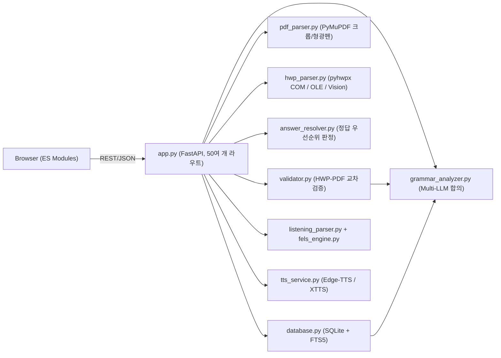

# 05-gichul_db 코드 리뷰 보고서

> [!NOTE]
> `/ask` 모드로 작성한 분석 보고서입니다. 소스 코드는 수정하지 않았습니다.
> 분석 기준: 2026-10-04 작업 트리 (백엔드 Python 14개 모듈, 프론트엔드 ES 모듈 14개, 테스트 3개)

---

## 1. 프로젝트 개요

| 구분 | 내용 |
|---|---|
| 목적 | 수능·모의고사 영어 기출 DB (독해/듣기 지문, 문장, 어법, 정답률, TTS) |
| 백엔드 | FastAPI + SQLite(WAL, FTS5) + PyMuPDF + pyhwpx(HWP COM) + 여러 LLM API |
| 프론트엔드 | 빌드 없는 Vanilla JS ES 모듈 + 단일 `index.html`/`style.css` |
| 주요 파일 규모 | `app.py` 2,180줄 · `database.py` 2,064줄 · `grammar_analyzer.py` 1,337줄 · `results-passage.js` 2,763줄 · `style.css` 6,355줄 · `index.html` 1,962줄 |
| 데이터 | `gichul.db` 약 186MB, `static/captures` 이미지 약 18,000개 |
| 테스트 | `tests/` 3개 파일 (순수 함수 단위 테스트) |

---

## 2. 장점

### 2-1. 정답 결정 로직이 탄탄함 ⭐
- [answer_resolver.py](file:///c:/Users/user/Desktop/web%20app/05-gichul_db/answer_resolver.py#L1-L35)에 정답 출처 우선순위 6단계가 명시되어 있습니다 (`uploaded_json > csv > verified_key > image_consensus > image_single > hwp`).
- 검증되지 않은 출처는 `answer_verified=0`으로 저장하고 경고를 띄웁니다. 조용히 대체하지 않는 방식입니다.
- 정답률 CSV가 **다른 시험의 데이터인지** 통계적으로 감지합니다 (`CSV_SUSPECT_RATIO`). 정답률과 선지 선택률이 맞는지로 정답을 역추론하는 것도 좋은 아이디어입니다.
- 이 로직은 [test_answer_resolver.py](file:///c:/Users/user/Desktop/web%20app/05-gichul_db/tests/test_answer_resolver.py)(213줄)로 테스트되고 있습니다.

### 2-2. 검색 성능 최적화가 체계적임
- FTS5 가상 테이블과 자동 동기화 트리거, 복합 B-Tree 인덱스 20개를 씁니다 ([database.py:L299-L376](file:///c:/Users/user/Desktop/web%20app/05-gichul_db/database.py#L299-L376)).
- WAL, `mmap_size`, `cache_size` 등 SQLite PRAGMA를 튜닝했습니다 ([database.py:L29-L40](file:///c:/Users/user/Desktop/web%20app/05-gichul_db/database.py#L29-L40)).
- N+1 쿼리를 없앴습니다. 태그와 어법은 900개씩 묶어 한 번에 조회합니다 ([database.py:L1886-L1912](file:///c:/Users/user/Desktop/web%20app/05-gichul_db/database.py#L1886-L1912)).
- `meta_only` 경량 응답, GZip 미들웨어, `orjson`, LRU 캐시를 함께 써서 응답이 빠릅니다.

### 2-3. 여러 LLM 합의 + 일부 실패 허용
- [grammar_analyzer.py:L1028-L1093](file:///c:/Users/user/Desktop/web%20app/05-gichul_db/grammar_analyzer.py#L1028-L1093)은 여러 모델을 병렬로 호출해 다수결로 판정합니다 (`strict` / `at_least_2` / `majority`).
- 일부 모델이 실패해도 살아남은 모델 수에 맞춰 기준을 조정하고 계속 진행합니다.
- 어떤 모델이 찬성했는지를 해설에 남겨서 결과의 근거를 확인할 수 있습니다.

### 2-4. 도메인 기능이 풍부함
- PDF 문항 크롭 + 정답 선지 형광펜, 41~42 / 43~45 세트 문항 병합 ([pdf_parser.py](file:///c:/Users/user/Desktop/web%20app/05-gichul_db/pdf_parser.py))
- HWP와 PDF 본문을 `difflib` 유사도로 교차 검증 ([validator.py](file:///c:/Users/user/Desktop/web%20app/05-gichul_db/validator.py))
- 듣기 대본 추출, FELS 빈칸 학습지, M/W 두 목소리 TTS
- 빈칸·밑줄 문장에 정답 선지를 넣어 완전한 문장으로 복원하는 전처리
- 교사가 실제로 쓰는 흐름(정답 수동 정정 → 키 파일 기록 → 형광펜 재생성)이 끝까지 이어져 있습니다.

### 2-5. 로컬 전용 설계 + 설치가 쉬움
- `127.0.0.1`에만 바인딩해서 외부 노출을 차단합니다 ([run.py:L40-L45](file:///c:/Users/user/Desktop/web%20app/05-gichul_db/run.py#L40-L45)).
- `run.py` / `start.bat` / `install.bat`로 원클릭 실행이 되고, 브라우저도 자동으로 열립니다.
- [requirements.txt](file:///c:/Users/user/Desktop/web%20app/05-gichul_db/requirements.txt)는 버전을 고정했고, Windows 전용 패키지는 `sys_platform`으로 분기하며, cp949 관련 주석까지 달려 있습니다.

### 2-6. 기존 DB를 깨지 않는 마이그레이션
- `ALTER TABLE ... ADD COLUMN`을 `try/except`로 감싸서 기존 DB를 유지한 채 컬럼을 추가합니다.
- `db_migration_version` 설정값으로 1회성 데이터 보정을 관리합니다.

### 2-7. 프론트엔드 모듈 분리
- 예전의 단일 `main.js`를 14개 ES 모듈로 나눴습니다. 공유 상태는 [state.js](file:///c:/Users/user/Desktop/web%20app/05-gichul_db/static/js/state.js)에 모으고, DOM 참조는 `dom.js`로 분리했습니다.
- `escapeHtml()`을 220회 이상 호출하는 등 XSS를 의식한 코드입니다.
- 빌드 도구 없이 바로 실행됩니다.

### 2-8. 세부 품질 처리
- API 키에 ASCII가 아닌 문자가 섞이면 미리 막고, 키는 마스킹해서 반환합니다 ([app.py:L746-L780](file:///c:/Users/user/Desktop/web%20app/05-gichul_db/app.py#L746-L780)).
- 한글 파일명 다운로드에 RFC 5987(`filename*=UTF-8''`) 인코딩을 적용했습니다.
- HWP COM 인스턴스를 하나만 만들어 재사용하고, 포커스 탈취를 막는 처리도 있습니다 ([hwp_parser.py:L244-L297](file:///c:/Users/user/Desktop/web%20app/05-gichul_db/hwp_parser.py#L244-L297)).
- 순수 파이썬 OLE 추출을 먼저 시도해서 한컴 의존도를 줄였습니다.

### 2-9. 문서화와 작업 규칙
- 모듈마다 한국어 docstring과 상세한 주석이 있습니다.
- `AGENTS.md`, `CLAUDE.md`, `.agents/skills`로 AI 협업 규칙이 정리되어 있습니다.

---

## 3. 단점 및 대안

심각도 표기: 🔴 확정 버그/데이터 위험 · 🟠 아키텍처/성능 · 🟡 유지보수성 · ⚪ 저장소 관리

### 🔴 3-1. 검색 캐시가 무효화되지 않음 (데이터가 갱신되지 않은 것처럼 보임)
- **근거**: [app.py:L66-L92](file:///c:/Users/user/Desktop/web%20app/05-gichul_db/app.py#L66-L92)의 `search_cache`에 `clear()` 메서드는 있지만 **프로젝트 어디에서도 호출하지 않습니다**.
- **영향**: 태그 추가, 메모, 정답 정정, 업로드, 삭제, 크롭 재생성을 해도 `/api/search/*`와 `/api/exams/{id}/passages`는 서버를 재시작할 때까지 예전 결과를 돌려줍니다.
- **대안**:
  - 쓰기 API(POST/PATCH/PUT/DELETE)가 성공하면 `search_cache.clear()`를 호출합니다. 미들웨어 하나로 공통 처리할 수 있습니다.
  - 또는 `database.py`의 `invalidate_exams_cache()`와 합쳐서 "DB 쓰기 → 모든 캐시 무효화" 훅 하나로 통일합니다.

### 🔴 3-2. 듣기 ZIP 다운로드 API가 항상 실패함
- **근거**: [tts_service.create_listening_zip](file:///c:/Users/user/Desktop/web%20app/05-gichul_db/tts_service.py#L529-L574)은 **dict**를 반환합니다. 그런데 [app.py:L509-L510](file:///c:/Users/user/Desktop/web%20app/05-gichul_db/app.py#L503-L514)은 그 값을 경로 문자열로 보고 `os.path.exists(zip_path)`를 호출하므로 `TypeError` → 500 에러가 납니다. `ValueError`도 잡지 않습니다.
- **대안**: `result["zip_url"]`로 실제 경로를 꺼내 `FileResponse`로 반환하고, `ValueError`는 404로 바꿉니다.

### 🔴 3-3. XTTS 음성 합성 결과물이 손상됨
- **근거**: [tts_service.py:L404-L438](file:///c:/Users/user/Desktop/web%20app/05-gichul_db/tts_service.py#L404-L438)은 대사마다 만든 **WAV 파일(헤더 포함)을 바이트째 이어 붙인 뒤 `.mp3` 확장자로** 저장합니다.
- **영향**: 대부분의 플레이어는 첫 번째 WAV 헤더에 적힌 길이만큼만 재생합니다. 그래서 첫 대사만 들리거나 파일이 잘못된 형식으로 인식됩니다. (Edge-TTS는 MP3 프레임을 잇는 방식이라 대체로 정상입니다.)
- **대안**: `soundfile`/`numpy`로 PCM 샘플만 이어 붙이고 대사 사이에 무음 구간을 넣은 뒤, `ffmpeg`/`pydub`으로 MP3 인코딩하거나 `.wav`로 정직하게 저장합니다.
- **추가**: 기본 엔진이 `xtts`인데 ([tts_service.py:L124](file:///c:/Users/user/Desktop/web%20app/05-gichul_db/tts_service.py#L122-L145), [state.js:L35](file:///c:/Users/user/Desktop/web%20app/05-gichul_db/static/js/state.js#L35)) `torch`/`TTS`는 requirements에 없습니다. 새로 설치하면 바로 실패하므로 기본값을 `edge-tts`로 바꾸는 것이 좋습니다.

### 🔴 3-4. 업로드 후 자동 어법 분석이 대부분의 시험에서 실행되지 않음
- **근거**: [app.py:L1187-L1189](file:///c:/Users/user/Desktop/web%20app/05-gichul_db/app.py#L1180-L1224)는 `search_sentences(limit=1000)`로 **최신순 상위 1,000문장만** 가져온 뒤 시험 ID 접두사로 걸러냅니다. 전체 문장은 7만 개 수준입니다.
- **영향**: 최신이 아닌 시험(예: 2015년)을 업로드하면 대상 문장이 0개가 되어 아무 작업 없이 조용히 끝납니다.
- **같은 패턴이 반복되는 곳**:
  - 단일 분석 폴백 `limit=2000` ([app.py:L925-L931](file:///c:/Users/user/Desktop/web%20app/05-gichul_db/app.py#L925-L931))
  - 배치 분석에서 전체 7만 문장을 불러온 뒤 파이썬으로 필터링 ([app.py:L1107-L1110](file:///c:/Users/user/Desktop/web%20app/05-gichul_db/app.py#L1107-L1110))
- **대안**: `WHERE p.exam_id = ?`나 `WHERE s.id IN (...)` 조건을 받는 전용 DB 함수(`get_sentences_by_exam`, `get_sentences_by_ids`)를 추가합니다.

### 🔴 3-5. 재업로드 시 남는 데이터 / 부분 실패 시 불일치
- **근거**:
  - [save_sentences](file:///c:/Users/user/Desktop/web%20app/05-gichul_db/database.py#L1069-L1083)는 UPSERT만 합니다. 문장 분할 결과가 줄어들면 **예전 문장이 그대로 남습니다**. 문장 내용이 바뀌어도 예전 AI 어법 분석이 그대로 연결되어 있습니다.
  - [api_upload_exam](file:///c:/Users/user/Desktop/web%20app/05-gichul_db/app.py#L1228-L1506)은 `save_exam`을 먼저 실행하고, 지문은 하나씩 별도 연결로 커밋합니다. 중간에 실패하면 반쯤 저장된 시험이 남습니다.
  - HWP 단독 업로드는 파싱에 실패해도 `"status": "success"`를 반환합니다 ([app.py:L1934-L1940](file:///c:/Users/user/Desktop/web%20app/05-gichul_db/app.py#L1934-L1940)).
- **대안**:
  - 업로드 저장 단계를 **단일 트랜잭션**으로 묶습니다. 시험 단위로 기존 문장을 삭제하고 다시 넣되, 별표·태그·사용자 어법처럼 사용자가 만든 데이터는 텍스트 해시로 다시 연결합니다.
  - 실패한 경우에는 `status: "partial"` / HTTP 207 등으로 정확히 알립니다.

### 🟠 3-6. `async def` 안에서 오래 걸리는 동기 작업을 실행 → 서버 전체가 멈춤
- **근거**: 거의 모든 라우트가 `async def`인데, 내부에서 다음을 동기로 호출합니다.
  - `sqlite3` 쿼리
  - PyMuPDF 크롭
  - HWP COM 호출
  - `urllib`로 LLM 호출 (timeout 최대 120초, [grammar_analyzer.py:L905](file:///c:/Users/user/Desktop/web%20app/05-gichul_db/grammar_analyzer.py#L896-L905))
- **영향**: 배치 어법 분석([app.py:L1099](file:///c:/Users/user/Desktop/web%20app/05-gichul_db/app.py#L1099-L1177))이나 업로드를 실행하는 동안에는 **다른 모든 요청(검색, 화면 로드)이 몇 분씩 멈춥니다**.
- **대안**:
  - 블로킹 위주의 라우트는 `def`로 선언합니다. 이렇게 하면 FastAPI가 자동으로 스레드풀에서 실행합니다.
  - 꼭 `async`여야 하는 라우트는 `await asyncio.to_thread(...)`로 감쌉니다.
  - 배치 분석과 업로드는 **작업 ID를 반환하는 백그라운드 작업 + 진행률 폴링/SSE** 방식으로 바꿉니다.

### 🟠 3-7. FTS 트리거가 비효율적임
- **근거**: [database.py:L342-L376](file:///c:/Users/user/Desktop/web%20app/05-gichul_db/database.py#L342-L376)
  - `passage_id`/`sentence_id` 컬럼이 `UNINDEXED`라서 `DELETE FROM sentences_fts WHERE sentence_id = old.id`가 **매번 FTS 테이블 전체를 스캔합니다**.
  - `AFTER UPDATE` 트리거가 컬럼 구분 없이 실행됩니다. 그래서 별표 토글이나 `grammar_analyzed` 플래그를 바꿀 때도 7만 행 FTS 재색인 비용이 듭니다.
- **대안**:
  - `AFTER UPDATE OF sentence_text ON sentences`처럼 **특정 컬럼에만** 트리거를 겁니다.
  - 장기적으로는 `content='sentences', content_rowid='rowid'` 외부 콘텐츠 FTS5로 바꿔서 rowid로 바로 삭제합니다.

### 🟠 3-8. DB 연결이 닫히지 않고 매번 초기화 비용이 듦
- **근거**: `with get_connection() as conn:`은 sqlite3에서 **커밋/롤백만 하고 연결을 닫지 않습니다**. 연결을 만들 때마다 PRAGMA 6개와 `create_function`도 다시 실행됩니다 ([database.py:L29-L40](file:///c:/Users/user/Desktop/web%20app/05-gichul_db/database.py#L29-L40)).
- **영향**: 연결 해제가 GC에 맡겨집니다. Windows에서는 파일 잠금이나 `-wal`/`-shm` 정리가 지연될 수 있습니다.
- **대안**: `contextlib.contextmanager`로 `try/yield/finally: conn.close()`를 하는 래퍼를 만듭니다. 또는 스레드 로컬로 연결을 재사용합니다. `journal_mode=WAL`은 DB 파일에 영구 저장되므로 `init_db`에서 한 번만 설정하면 됩니다.

### 🟠 3-9. FTS 실패 시 LIKE로 넘어가는 코드가 실제로는 실행되지 않음
- **근거**: [database.py:L1283-L1304](file:///c:/Users/user/Desktop/web%20app/05-gichul_db/database.py#L1283-L1304), [L1822-L1829](file:///c:/Users/user/Desktop/web%20app/05-gichul_db/database.py#L1822-L1829)의 `try`는 **쿼리 문자열을 만드는 부분만** 감쌉니다. FTS 오류는 나중에 `execute()` 시점에 발생하므로 `except`의 LIKE 대체 경로는 실행될 수 없습니다.
- **대안**: `execute()`를 `try`로 감싸고, `sqlite3.OperationalError`가 나면 LIKE 쿼리를 다시 만들어 재실행합니다.

### 🟠 3-10. 모듈 import만 해도 부작용이 생기고 의존 방향이 뒤엉킴
- **근거**:
  - `database.py` 맨 끝의 `init_db()`([L2063](file:///c:/Users/user/Desktop/web%20app/05-gichul_db/database.py#L2063))가 **import만 해도** 실제 DB에 마이그레이션과 데이터 보정을 실행합니다.
  - `tts_service.py`는 import할 때 `torch`를 불러오고 `torchaudio.load`를 전역으로 바꿔치기합니다 ([L34-L51](file:///c:/Users/user/Desktop/web%20app/05-gichul_db/tts_service.py#L34-L51)).
  - 데이터 계층(`database.search_sentences`)과 `validator`가 AI 모듈(`grammar_analyzer`)을 import하는 **역방향 의존**이 있습니다.
- **대안**:
  - FastAPI `lifespan` 이벤트에서 `init_db()`를 명시적으로 호출합니다.
  - `torch` 관련 import는 XTTS를 실제로 쓸 때로 미룹니다.
  - 빈칸 복원 함수(`prepare_sentence_for_analysis`)는 `text_utils.py` 같은 순수 모듈로 옮겨 의존 방향을 한쪽으로 정리합니다.

### 🟡 3-11. 거대 파일과 중복 코드
- **근거**:
  - `app.py` 하나에 라우트 50여 개와 비즈니스 로직이 섞여 있습니다.
  - `clean_id = ...; if not startswith("[")` 패턴이 **20회 이상** 복붙되어 있습니다.
  - 해설의 `[정답]` 헤더를 정규식으로 갱신하는 코드가 4곳에 있습니다 ([app.py:L1404](file:///c:/Users/user/Desktop/web%20app/05-gichul_db/app.py#L1404-L1411), [L1696](file:///c:/Users/user/Desktop/web%20app/05-gichul_db/app.py#L1696-L1699), [L1756](file:///c:/Users/user/Desktop/web%20app/05-gichul_db/app.py#L1756-L1759), [database.py:L207](file:///c:/Users/user/Desktop/web%20app/05-gichul_db/database.py#L207-L215)).
  - 어법 분석 루프(전처리 → 분석 → 저장)가 3곳에 복제되어 있습니다 (단일, 배치, 백그라운드).
- **대안**:
  - `APIRouter`로 나눕니다: `routers/search.py`, `upload.py`, `grammar.py`, `listening.py`, `settings.py`
  - 공통 함수를 추출합니다: `normalize_bracket_id()`, `apply_answer_header()`, `analyze_and_save_sentence()`
  - 업로드 파이프라인은 `services/ingest.py`로 옮깁니다.

### 🟡 3-12. 연도/문항별 하드코딩된 예외 처리
- **근거**:
  - `year == 2013`, `2006 <= year <= 2011` 같은 분기가 `app.py`, `pdf_parser.py`, `listening_parser.py`, `hwp_parser.py` 4개 파일에 25곳 넘게 흩어져 있습니다.
  - 특정 시험 전용 스크립트(`tools/crop_2013_09.py`, `fix_2012_11_and_2013_03.py`)를 앱 코드가 직접 import합니다 ([app.py:L272-L277](file:///c:/Users/user/Desktop/web%20app/05-gichul_db/app.py#L271-L277)).
- **대안**: `exam_profiles.json`(또는 `.py`) 하나에 시기별 규칙(독해 범위, A/B형, 50문항 체제, 듣기 문항 수, 전용 크롭 전략)을 모아 **데이터로 관리**합니다. 코드는 프로파일만 조회하도록 바꿉니다.

### 🟡 3-13. 테스트 범위가 좁음
- **근거**: 정식 테스트는 순수 함수 3개 모듈뿐입니다. DB 계층, API, 파서, TTS는 회귀 테스트가 없습니다. 대신 `scratch/`에 일회성 검증 스크립트 116개가 흩어져 있습니다.
- **영향**: 3-1~3-4 같은 버그가 테스트로 잡히지 않았습니다.
- **대안**:
  - 임시 DB를 쓰는 `pytest` 픽스처를 만듭니다. `DB_PATH`를 환경변수로 받게 바꿔야 합니다.
  - `fastapi.testclient`로 주요 API 스모크 테스트를 작성합니다 (검색, 태그 후 재검색, 정답 정정, ZIP).
  - 샘플 PDF 1세트로 파서 스냅샷 테스트를 만듭니다.
  - `scratch/`의 스크립트 중 가치 있는 것은 `tests/`로 옮깁니다.

### 🟡 3-14. 오류 처리와 로깅이 일관되지 않음
- **근거**:
  - `except Exception: pass` 패턴이 **43곳**에 있습니다.
  - `print()`와 `logger`가 섞여 있습니다 (`print` 54회).
  - `HTTPException(detail=str(e))`로 내부 예외 메시지를 그대로 사용자에게 보냅니다.
- **대안**:
  - `logging.basicConfig` + 파일 핸들러(`logs/app.log`, 용량 기준 로테이션)로 통일합니다.
  - 그냥 넘어가는 대신 최소한 `logger.debug(..., exc_info=True)`를 남깁니다.
  - 공통 예외 핸들러를 등록해 응답 형식을 `{success, message, code}`로 맞춥니다.

### 🟡 3-15. 보안·안전성 (로컬 앱 기준 낮음~중간)
| 항목 | 근거 | 대안 |
|---|---|---|
| 업로드 파일명 미검증 | [app.py:L1249-L1250](file:///c:/Users/user/Desktop/web%20app/05-gichul_db/app.py#L1249-L1250)에서 `filename`을 그대로 경로에 씀 (`..\` 포함 가능) | `os.path.basename()` + 허용 문자 화이트리스트 |
| API 키 평문 저장 | `app_settings` 테이블에 평문 ([app.py:L823](file:///c:/Users/user/Desktop/web%20app/05-gichul_db/app.py#L823)) | Windows `keyring`(DPAPI) 또는 `.env` 사용 |
| 시드 API가 실데이터를 덮어씀 | [api_seed_sample_data](file:///c:/Users/user/Desktop/web%20app/05-gichul_db/app.py#L2041-L2179)가 실제 ID(`[고3-2024년-06월-21번]`)로 UPSERT하면서 크롭 경로를 `""`로 덮어씀 (UI 버튼은 현재 없음) | 엔드포인트 삭제, 또는 `[SAMPLE-...]` 전용 ID + 존재 시 건너뛰기 |
| 토스트 `innerHTML` | [utils.js:L44](file:///c:/Users/user/Desktop/web%20app/05-gichul_db/static/js/utils.js#L44)가 서버 메시지(파일명 포함)를 그대로 삽입 | `textContent` 사용 |
| 경로 처리 불일치 | `DELETE /api/exams/{exam_id}`만 대괄호 정규화를 안 함 | 공통 의존성(`Depends`)으로 정규화 |

### 🟡 3-16. 교차검증 수치가 오해를 부를 수 있음
- **근거**: [validator.py:L80](file:///c:/Users/user/Desktop/web%20app/05-gichul_db/validator.py#L80)은 HWP나 PDF 중 **한쪽이 비어 있으면 일치율을 1.0(100%)** 으로 기록합니다. 비교를 못 한 것인데 "완전 일치"로 표시됩니다. 일치율이 낮아도 경고나 상태 변경이 없습니다.
- **대안**: 비교할 수 없는 경우는 `None`과 "비교 불가"로 표시합니다. 일정 기준(예: 0.9) 미만이면 `needs_review` 플래그를 세우고 UI에 배지로 보여줍니다.

### ⚪ 3-17. Git 저장소 크기 2.56GB
- **근거**: `git ls-files` 기준으로 `static/captures` 이미지 **18,137개**가 Git에 커밋되어 있습니다. 이미지는 언제든 재생성할 수 있는 산출물입니다. pack 크기는 2.56GiB입니다.
- **영향**: 클론과 푸시가 느리고, GitHub 용량 경고나 제한에 걸릴 수 있습니다.
- **대안**: `static/captures/`를 `.gitignore`에 추가하고 `git rm -r --cached`로 추적을 해제합니다. 히스토리까지 줄이려면 `git filter-repo`를 씁니다. 이미지는 `tools/regenerate_group_crops.py`로 다시 만들 수 있습니다. 보관이 꼭 필요하면 Git LFS를 씁니다.

### ⚪ 3-18. 작업 폴더 정리와 커밋 이력 가독성
- **근거**:
  - 루트에 쓰지 않는 DB 파일 3개(`database.db`, `database.sqlite3`, `exam_database.db`)가 있습니다.
  - `dist/`에 requirements에 없는 coqui/torch 계열 wheel이 수백 MB 있습니다.
  - `scratch/jsmod/node_modules`가 있습니다.
  - 모든 커밋 제목이 `docs: update README.md and detailed commit results`로 같습니다.
  - `README.md`가 누적 이력 때문에 257KB까지 커졌습니다.
- **대안**:
  - 불필요한 파일을 정리하고, XTTS용 추가 의존성은 `requirements-xtts.txt`로 분리합니다.
  - 커밋 제목은 `feat:`/`fix:` + 실제 변경 요약으로 쓰고, 정해진 문구는 본문이나 꼬리말로 옮기는 방식을 검토합니다.
  - 변경 이력은 `CHANGELOG.md`로 분리하는 방식을 검토합니다. (현재 rules 정책과 충돌하므로 규칙 개정이 먼저 필요합니다.)

### 🟡 3-19. 프론트엔드 유지보수성
- **근거**:
  - `index.html`에 인라인 `style=""`이 **367개** 있습니다.
  - `style.css` 단일 파일이 6,355줄입니다.
  - `results-passage.js` 하나가 2,763줄입니다.
  - `innerHTML` 템플릿 문자열로 화면을 그리는 코드가 150회 이상입니다.
- **대안**:
  - 인라인 스타일을 유틸리티 클래스로 옮기고, CSS를 기능별 파일(`search.css`, `viewer.css`, `grammar.css` 등)로 나눕니다.
  - `results-passage.js`는 렌더러, 이벤트 핸들러, API 호출 계층으로 나눕니다.
  - 반복되는 카드/배지는 `<template>` 요소나 작은 렌더 함수로 컴포넌트화합니다.

---

## 4. 개선 로드맵 (권장 순서)

| 단계 | 항목 | 예상 난이도 | 효과 |
|---|---|---|---|
| **1단계: 즉시 버그 수정** | 3-1 캐시 무효화, 3-2 ZIP API, 3-4 문장 조회 limit, 3-9 FTS 폴백, HWP 실패 응답 | 낮음 | 사용자가 체감하는 오류 즉시 해소 |
| **2단계: 안정성** | 3-6 블로킹 해소(`def` 전환/`to_thread`), 3-5 업로드 트랜잭션, 3-8 연결 close, 3-7 FTS 트리거 컬럼 한정, 3-3 TTS 오디오 결합 | 중간 | 동시 사용 시 멈춤 해소, 데이터 무결성 확보 |
| **3단계: 구조 개선** | 3-11 라우터/서비스 분리, 3-12 시험 프로파일 데이터화, 3-10 import 부작용 제거, 3-14 로깅 통일 | 중간~높음 | 신규 기능 추가 비용 감소 |
| **4단계: 품질 기반** | 3-13 API/DB 테스트, 3-17 저장소 용량 축소, 3-19 프론트 분리, 3-15 보안 정비 | 중간 | 회귀 방지, 협업/배포 용이 |

---

## 5. 종합 평가

| 관점 | 평가 | 한 줄 요약 |
|---|---|---|
| 도메인 완성도 | ★★★★★ | 교사의 실제 업무 흐름을 깊이 반영한 기능 구성 |
| 데이터 신뢰성 설계 | ★★★★☆ | 정답 우선순위/검증 설계는 우수하나 재업로드·트랜잭션 처리에 빈틈 |
| 성능 | ★★★★☆ | 검색은 매우 빠르나 오래 걸리는 작업이 이벤트 루프를 막음 |
| 정확성 (버그) | ★★★☆☆ | 캐시 무효화, ZIP, 자동 분석 범위 등 확정 버그 존재 |
| 유지보수성 | ★★☆☆☆ | 거대 파일, 중복, 하드코딩, 좁은 테스트 범위 |
| 저장소 관리 | ★★☆☆☆ | 2.56GB 저장소, 잡다한 산출물 |

**결론**: 기능의 깊이와 정답 검증 설계는 개인 프로젝트 수준을 넘어섭니다. 다만 기능을 빠르게 추가하는 동안 **캐시/트랜잭션/비동기 처리 같은 공통 기반이 따라가지 못했습니다**. 1~2단계(버그 수정 + 안정성)만 적용해도 체감 품질이 크게 좋아질 것으로 판단합니다.
